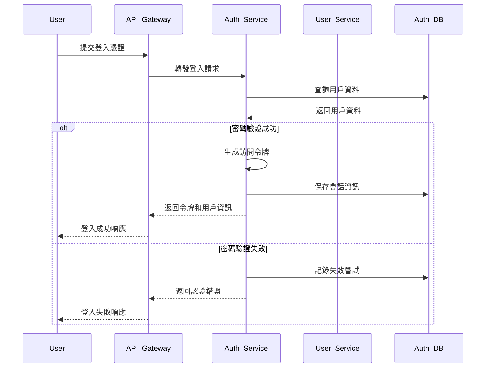
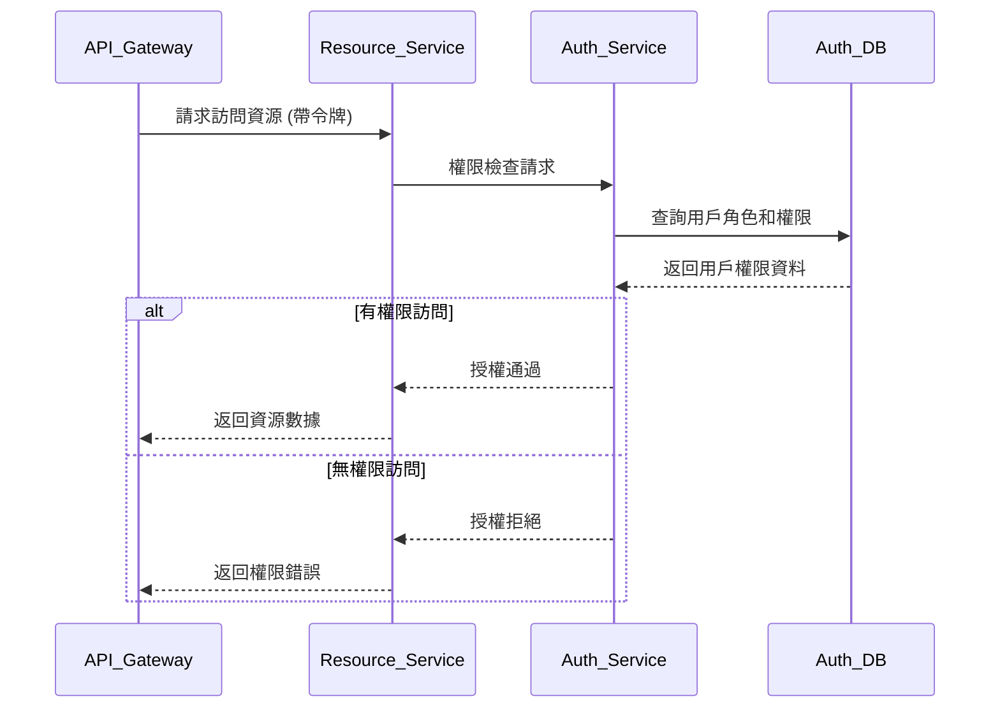

# 認證中心系統架構設計

本文檔詳細描述認證中心 (Auth Center) 的系統架構設計，包括核心組件、互動流程、設計模式和關鍵技術選擇。

## 1. 系統概述

認證中心是一個提供集中式身份驗證與授權服務的系統，支持多租戶、多因素認證和精細的權限控制。系統採用現代化的微服務架構，確保高可用性、可擴展性和安全性。

### 1.1 核心設計目標

- **安全性**: 實現強大的身份驗證和授權機制
- **可擴展性**: 支持從小型部署到企業級規模的擴展
- **高可用性**: 確保服務持續可用，無單點故障
- **靈活性**: 支持多種認證方式和授權策略
- **開發者友好**: 提供簡單易用的API和SDK
- **合規**: 符合行業標準和法規要求

### 1.2 系統邊界和整體架構


```
                                  ┌───────────────────────────────────────────┐
                                  │              API Gateway                   │
                                  └─────────────────┬─────────────────────────┘
                                                    │
             ┌───────────────────────────────────────────────────────────────────┐
             │                                                                   │
┌────────────┴─────────────┐ ┌─────────────┴───────────────┐ ┌─────────────┴────────────┐
│    Authentication        │ │      Authorization           │ │      User Management     │
│     Service              │ │      Service                 │ │      Service             │
└────────────┬─────────────┘ └─────────────┬───────────────┘ └─────────────┬────────────┘
             │                             │                               │
             └───────────────────────────────────────────────────────────────────┐
                                                    │
                                  ┌─────────────────┴─────────────────┐
                                  │           Database Layer           │
                                  └───────────────────────────────────┘
```

## 2. 系統組件設計

### 2.1 API 閘道層

API 閘道作為所有請求的入口點，負責請求路由、負載均衡、速率限制和初步身份驗證。

#### 設計細節

- **請求路由**: 將請求導向適當的服務
- **速率限制**: 防止濫用和 DoS 攻擊
- **日誌與監控**: 記錄所有請求，監控系統健康狀態
- **TLS 終止**: 處理 HTTPS 連接和證書管理
- **錯誤處理**: 提供統一的錯誤響應格式

#### 技術選擇

- **框架**: 使用 Gin 作為 Web 框架
- **中間件**: 自定義中間件處理跨切面關注點
- **負載均衡**: 使用 DNS 輪詢或 Kubernetes 服務
- **監控**: Prometheus 和 Grafana

### 2.2 認證服務 (Authentication Service)

認證服務負責驗證用戶身份，執行登入流程，並簽發訪問令牌。

#### 核心功能

- **多種認證方式**:
  - 用戶名/密碼驗證
  - OAuth/OIDC 集成
  - SAML 認證
  - 社交媒體登入

- **多因素認證 (MFA)**:
  - TOTP (基於時間的一次性密碼)
  - 推送通知
  - SMS/電子郵件驗證碼

- **令牌管理**:
  - JWT 簽發與驗證
  - 令牌刷新
  - 令牌撤銷

#### 數據模型

- Users
- UserSessions
- AuthenticationMethods
- MFASettings
- AccessTokens

#### 關鍵 API 端點

- `POST /v1/auth/login`: 用戶登入
- `POST /v1/auth/logout`: 用戶登出
- `POST /v1/auth/refresh`: 刷新訪問令牌
- `POST /v1/auth/mfa/initiate`: 初始化多因素認證
- `POST /v1/auth/mfa/verify`: 驗證多因素認證
- `GET /v1/auth/providers`: 獲取可用認證提供商

#### 設計模式

- **策略模式**: 處理不同的認證策略
- **裝飾器模式**: 為基本認證添加多因素認證
- **工廠模式**: 創建不同類型的認證提供商

### 2.3 授權服務 (Authorization Service)

授權服務負責管理和執行訪問控制決策，確定用戶對資源的訪問權限。

#### 核心功能

- **角色基礎訪問控制 (RBAC)**:
  - 角色管理
  - 權限分配
  - 角色繼承

- **屬性基礎訪問控制 (ABAC)**:
  - 動態決策
  - 複雜條件評估
  - 政策管理

- **權限檢查**:
  - 資源訪問驗證
  - 權限推斷
  - 權限緩存

#### 數據模型

- Roles
- Permissions
- ResourceTypes
- Policies
- RoleAssignments

#### 關鍵 API 端點

- `GET /v1/authz/permissions`: 獲取權限列表
- `POST /v1/authz/check`: 檢查特定操作的權限
- `POST /v1/authz/roles`: 創建角色
- `POST /v1/authz/policies`: 創建授權政策
- `GET /v1/authz/roles/{id}/permissions`: 獲取角色權限

#### 設計模式

- **命令模式**: 執行權限檢查操作
- **訪問者模式**: 處理不同資源類型的權限評估
- **解釋器模式**: 解析和評估 ABAC 策略表達式

### 2.4 用戶管理服務 (User Management Service)

用戶管理服務負責處理用戶生命週期，包括註冊、個人資料管理和組織關係。

#### 核心功能

- **用戶生命週期管理**:
  - 用戶註冊
  - 帳戶激活/停用
  - 密碼重置

- **個人資料管理**:
  - 用戶資料更新
  - 自定義屬性
  - 隱私設置

- **組織管理**:
  - 組織創建和管理
  - 團隊和成員管理
  - 組織層級設置

#### 數據模型

- Users
- Organizations
- Teams
- OrganizationMembers
- TeamMembers
- UserPreferences

#### 關鍵 API 端點

- `POST /v1/users`: 創建用戶
- `GET /v1/users/{id}`: 獲取用戶資訊
- `PUT /v1/users/{id}`: 更新用戶資訊
- `POST /v1/users/{id}/activate`: 激活用戶
- `POST /v1/organizations`: 創建組織
- `GET /v1/organizations/{id}/members`: 獲取組織成員

#### 設計模式

- **CQRS**: 分離用戶數據的讀寫操作
- **觀察者模式**: 處理用戶相關事件
- **模板方法**: 處理不同類型的用戶註冊流程

### 2.5 安全與審計服務 (Security & Audit Service)

安全與審計服務負責監控和記錄系統活動，檢測安全威脅，並提供合規報告。

#### 核心功能

- **審計日誌**:
  - 重要操作記錄
  - 數據變更追踪
  - 合規報告生成

- **安全監控**:
  - 異常行為檢測
  - 失敗登入追踪
  - 安全事件通知

- **風險評估**:
  - 用戶行為分析
  - 威脅評分
  - 可疑活動報告

#### 數據模型

- AuditLogs
- SecurityEvents
- RiskAssessments
- AlertSettings

#### 關鍵 API 端點

- `GET /v1/audit/logs`: 查詢審計日誌
- `GET /v1/security/events`: 獲取安全事件
- `POST /v1/security/alerts`: 配置安全警報
- `GET /v1/security/risks`: 獲取風險評估報告

#### 設計模式

- **觀察者模式**: 處理系統事件
- **策略模式**: 應用不同的安全規則
- **建造者模式**: 構建複雜的審計報告

## 3. 主要流程設計

### 3.1 用戶認證流程



### 3.2 授權決策流程



## 4. 系統設計模式應用

### 4.1 CQRS (命令查詢責任分離)

認證中心採用 CQRS 模式分離讀取和寫入操作，特別是在用戶管理和授權服務中。

#### 實現細節

- **查詢模型**:
  - 針對讀取操作優化的數據結構
  - 可能使用非規範化數據
  - 使用快取提高性能

- **命令模型**:
  - 針對寫入操作優化
  - 保持數據一致性和完整性
  - 驗證所有輸入

#### 代碼示例

```go
// 命令處理器
func (s *UserService) UpdateUser(ctx context.Context, cmd command.UpdateUserCommand) error {
    // 驗證命令
    if err := cmd.Validate(); err != nil {
        return err
    }
    
    // 處理業務邏輯
    user, err := s.repository.GetUserByID(ctx, cmd.UserID)
    if err != nil {
        return err
    }
    
    // 應用更新
    user.UpdateFromCommand(cmd)
    
    // 保存更改
    return s.repository.SaveUser(ctx, user)
}

// 查詢處理器
func (s *UserService) GetUserProfile(ctx context.Context, query query.GetUserProfileQuery) (*dto.UserProfile, error) {
    // 從針對讀取優化的存儲中獲取數據
    profile, err := s.readRepository.GetUserProfile(ctx, query.UserID)
    if err != nil {
        return nil, err
    }
    
    return profile, nil
}
```

### 4.2 領域驅動設計 (DDD)

系統架構遵循 DDD 原則，將業務邏輯組織到明確定義的領域和限界上下文中。

#### 限界上下文

- **身份驗證上下文**: 處理用戶認證和會話管理
- **授權上下文**: 處理權限和訪問控制
- **用戶管理上下文**: 處理用戶資料和組織關係
- **審計上下文**: 處理日誌和安全事件

#### 實體和值對象

- **實體**: User, Role, Permission, Organization
- **值對象**: Credential, Address, ContactInfo, TokenClaims

#### 聚合根

- **User**: 管理用戶身份和認證方式
- **Role**: 管理權限集合
- **Organization**: 管理成員和團隊

### 4.3 服務層架構

系統採用清晰的服務層架構，確保關注點分離和代碼組織。

#### 層級結構

1. **API 層**: 處理 HTTP 請求和響應
2. **服務層**: 實現業務邏輯
3. **領域層**: 包含核心業務規則和實體
4. **存儲層**: 處理數據持久化

#### 依賴注入

使用依賴注入減少組件間的耦合，提高可測試性。

```go
// 服務配置
func SetupServices(cfg *config.Config) *ServiceContainer {
    // 創建存儲組件
    userRepo := postgres.NewUserRepository(cfg.Database)
    roleRepo := postgres.NewRoleRepository(cfg.Database)
    
    // 創建核心服務
    userService := user.NewService(userRepo)
    authService := auth.NewService(userRepo, cfg.JWT)
    roleService := role.NewService(roleRepo)
    
    // 返回服務容器
    return &ServiceContainer{
        UserService: userService,
        AuthService: authService,
        RoleService: roleService,
    }
}
```

## 5. 技術實現細節

### 5.1 認證令牌處理

系統使用 JWT (JSON Web Tokens) 進行認證令牌的生成和驗證。

#### JWT 結構

```json
{
  "header": {
    "alg": "RS256",
    "typ": "JWT"
  },
  "payload": {
    "sub": "1234567890",
    "name": "John Doe",
    "iat": 1516239022,
    "exp": 1516242622,
    "roles": ["user", "admin"],
    "org_id": "org_123456"
  },
  "signature": "..."
}
```

#### 令牌管理

- **簽名算法**: RS256 (非對稱加密)
- **令牌過期**: 短期訪問令牌 (15-60分鐘)
- **令牌續期**: 使用刷新令牌 (較長期限)
- **令牌撤銷**: 通過黑名單或短期過期實現

### 5.2 密碼安全處理

系統採用現代密碼學方法保護用戶密碼和敏感數據。

#### 密碼哈希

- **算法**: Argon2id
- **參數**:
  - 記憶體成本: 64 MB
  - 時間成本: 3 次迭代
  - 並行度: 4
  - 鹽長度: 16 字節
  - 輸出長度: 32 字節

#### 實現示例

```go
func HashPassword(password string) (string, error) {
    // 生成隨機鹽值
    salt := make([]byte, 16)
    if _, err := rand.Read(salt); err != nil {
        return "", err
    }
    
    // 設置 Argon2id 參數
    params := &Argon2Params{
        Memory:      64 * 1024,
        Iterations:  3,
        Parallelism: 4,
        SaltLength:  16,
        KeyLength:   32,
    }
    
    // 計算哈希
    hash := argon2.IDKey(
        []byte(password),
        salt,
        params.Iterations,
        params.Memory,
        params.Parallelism,
        params.KeyLength,
    )
    
    // 編碼結果
    return encodeHash(params, salt, hash), nil
}
```

### 5.3 分布式部署與擴展

系統設計支持分布式部署和水平擴展，以應對高負載和高可用性需求。

#### 無狀態設計

- 所有服務都是無狀態的，可以水平擴展
- 使用 Redis 存儲分佈式會話和快取
- JWT 啟用無狀態身份驗證

#### 部署選項

- **Kubernetes**: 容器編排和服務發現
- **多區域部署**: 跨地理位置的冗餘
- **藍綠部署**: 無停機更新

#### 高可用性考量

- **資料庫複製**: 主-從設置
- **服務冗餘**: 每個服務至少運行兩個實例
- **負載均衡**: 在服務實例之間分配流量

## 6. 系統整合與擴展

### 6.1 外部系統整合

認證中心設計為可以與多種外部系統集成，擴展其功能。

#### 支持的整合

- **身份提供者**: Google, Facebook, GitHub, SAML IdPs
- **企業目錄**: LDAP, Active Directory
- **事件流**: Kafka, RabbitMQ
- **監控系統**: Prometheus, Grafana, ELK Stack

#### 整合架構

- **適配器模式**: 統一不同外部系統的介面
- **事件驅動**: 通過事件總線與外部系統通信
- **API 閘道**: 提供統一的 API 訪問點

### 6.2 插件架構

系統提供插件機制，允許擴展核心功能而無需修改原始代碼。

#### 插件類型

- **認證提供者**: 添加新的身份驗證方法
- **授權策略**: 實現自定義授權規則
- **事件處理器**: 響應系統事件的自定義邏輯

#### 實現機制

- **接口定義**: 清晰定義插件需要實現的接口
- **動態加載**: 在運行時發現和加載插件
- **隔離執行**: 確保插件不會影響核心系統穩定性

## 7. 安全設計考量

### 7.1 防禦深度策略

系統採用多層防禦策略保護用戶數據和系統資源。

#### 安全層級

1. **網絡層**: 防火牆, WAF, DDoS 保護
2. **應用層**: 輸入驗證, CSRF 保護, XSS 防禦
3. **認證層**: 多因素認證, 暴力破解防護
4. **授權層**: 精細的訪問控制
5. **數據層**: 加密, 資料隔離

#### 關鍵安全控制

- **TLS 加密**: 所有通信使用 TLS 1.3
- **CSRF 令牌**: 防止跨站請求偽造攻擊
- **速率限制**: 防止暴力破解和 DoS 攻擊
- **HTTP 安全標頭**: CSP, X-XSS-Protection 等

### 7.2 隱私保護

系統設計符合現代隱私法規和最佳實踐。

#### 隱私功能

- **數據最小化**: 僅收集必要信息
- **明確同意**: 用戶對數據使用的明確許可
- **數據控制**: 用戶可以訪問和刪除自己的數據
- **資料本地化**: 支持數據存儲位置限制

#### 實現方法

- **隱私設計**: 從設計階段考慮隱私保護
- **數據分類**: 識別和特殊處理敏感數據
- **匿名化**: 適當時對數據進行匿名化處理

## 8. 系統監控與可觀測性

### 8.1 指標和監控

系統實現全面的監控和指標收集。

#### 關鍵指標

- **業務指標**: 登入成功率, 用戶活動, 令牌使用情況
- **技術指標**: 請求延遲, 錯誤率, 資源使用率
- **安全指標**: 失敗登入嘗試, 可疑活動, 權限變更

#### 實現技術

- **Prometheus**: 收集和存儲指標
- **Grafana**: 指標可視化和儀表板
- **Alertmanager**: 異常情況警報

### 8.2 日誌和追踪

系統實現結構化日誌和分佈式追踪。

#### 日誌策略

- **結構化日誌**: 使用 JSON 格式
- **上下文豐富**: 包含請求 ID, 用戶 ID, 服務名稱等
- **合適的級別**: 適當的日誌級別設置

#### 追踪實現

- **OpenTelemetry**: 分佈式追踪標準
- **追踪信息**: 請求路徑, 服務間調用, 數據庫查詢
- **採樣策略**: 確保追踪不會影響性能

## 9. 開發與測試策略

### 9.1 開發方法

系統開發採用現代化的敏捷開發實踐。

#### 關鍵實踐

- **測試驅動開發 (TDD)**: 先寫測試，再實現功能
- **持續集成 (CI)**: 自動化構建和測試
- **持續部署 (CD)**: 自動化部署流程
- **代碼審查**: 所有代碼都需要經過同行審查

#### 品質保證

- **靜態代碼分析**: 使用 golangci-lint
- **安全掃描**: 檢測已知漏洞
- **性能測試**: 確保系統符合性能要求

### 9.2 測試策略

系統實現多層次的測試策略。

#### 測試類型

- **單元測試**: 測試單個組件
- **集成測試**: 測試組件交互
- **系統測試**: 測試整個系統
- **性能測試**: 測試系統性能和擴展性
- **安全測試**: 檢測安全漏洞 